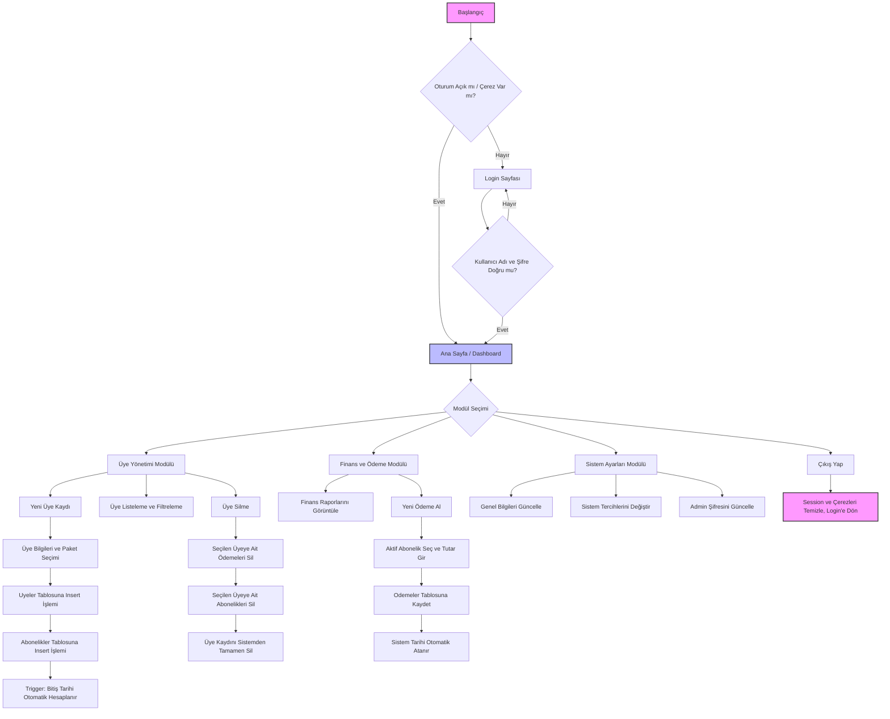

# DriFit Spor Salonu Takip Sistemi

**Kocaeli Üniversitesi - Bilişim Sistemleri Mühendisliği**
**TBL331: Veritabanı Yönetim Sistemleri Dönem Projesi**

## 1. Proje Özeti ve Genel Yapı
Bu proje, bir spor salonunun günlük operasyonlarını dijitalleştirmek amacıyla geliştirilmiş kapsamlı bir otomasyon sistemidir. 
* Sistem, üyelerin kayıtlarını, abonelik paketlerini, finansal ödemeleri ve antrenör atamalarını tek bir merkezden yönetmeyi sağlar.
* Proje; arka uçta Java ve Spring Boot, veritabanı yönetiminde MSSQL ve ön yüzde Thymeleaf, HTML, CSS kullanılarak geliştirilmiştir.
* Sistemde yönetici (Admin) ve resepsiyon rollerine sahip kullanıcılar için güvenli giriş altyapısı bulunmaktadır.
* Tüm veritabanı tabloları 5N normalizasyon kurallarına uygun olarak tasarlanmış ve veri bütünlüğünü korumak için kısıtlayıcılar (Constraints) kullanılmıştır.
* Veritabanı üzerinde iş mantığını yönetmek adına View, Trigger, Stored Procedure ve Index yapıları aktif olarak entegre edilmiştir.

## 2. Problem Tanımı
Spor salonlarında üye takibi, abonelik sürelerinin hesaplanması ve finansal kayıtların tutulması manuel yapıldığında ciddi hatalara yol açmaktadır.
* Süresi dolan üyelerin tespit edilememesi ve pasife çekilememesi.
* Üyelerin paket sürelerinin bitiş tarihlerinin manuel hesaplanmasındaki zorluklar.
* Antrenörlerin öğrenci sayılarının ve sağladıkları cironun anlık olarak izlenememesi.
* Bu proje, tüm bu süreçleri otomatikleştirerek insan hatasını en aza indirmeyi ve salon yönetimine anlık finansal analizler sunmayı hedeflemektedir.

## 3. Yapılan Araştırmalar
Projenin geliştirme sürecinde, veri bütünlüğünü ve iş akışını otomatize etmek için çeşitli yöntemler araştırılmıştır.
* **Tarih Hesaplamaları:** Yeni üye kaydında seçilen paketin ay süresine göre bitiş tarihinin otomatik hesaplanması için veritabanı seviyesinde Trigger (Tetikleyici) kullanılması gerektiği araştırılmış ve `trg_BitisTarihiHesapla` kurgulanmıştır.
* **Eşzamanlı Veri Kaydı:** Bir üye eklendiğinde aynı anda abonelik kaydının da hatasız oluşması için Transaction yapıları incelenmiş ve `sp_YeniUyeVeAbonelikKayit` isimli Stored Procedure geliştirilerek hata anında işlemlerin geri alınması (Rollback) sağlanmıştır.
* **Veri Görselleştirme:** Gösterge panelinde aylık gelir analizi ve paket dağılımı grafikleri için Chart.js kütüphanesinin kullanımı araştırılmış ve sisteme entegre edilmiştir.

## 4. Akış Şeması
Projenin temel işleyiş ve algoritma adımları şu şekildedir:
1. **Giriş:** Sistem kullanıcısı kimlik doğrulaması ile sisteme giriş yapar.
2. **Dashboard Kontrolü:** Sistem, veritabanındaki View'lar üzerinden aktif üye sayısı, aylık gelir ve süresi dolacak üyeleri getirir.
3. **Üye Kaydı Akışı:** Resepsiyon görevlisi üye bilgilerini girer -> Sistem paketi seçer -> Procedure tetiklenir -> Üye ve Abonelik tablolarına eşzamanlı kayıt atılır -> Trigger bitiş tarihini hesaplar.
4. **Ödeme Akışı:** Aktif abonelik üzerinden ödeme alınır -> Ödemeler tablosuna kayıt düşülür -> Muhasebe View'ları anlık olarak güncellenir.
5. **Durum Güncelleme:** Abonelik süresi biten veya iptal edilen üyeler, Trigger vasıtasıyla otomatik olarak "Pasif" duruma çekilir.

## 5. Yazılım Mimarisi ve Geliştirme Ortamı
Proje, MVC (Model-View-Controller) mimarisi prensiplerine uygun olarak modüler bir yapıda kodlanmıştır.
* **Geliştirme Ortamı:** IntelliJ IDEA (Java Spring Boot), Microsoft SQL Server Management Studio (Veritabanı), Web Tarayıcı.
* **Model Katmanı:** Veritabanı tablolarının Java class karşılıkları (Entity) oluşturulmuş ve JPA/Hibernate ile eşleştirilmiştir.
* **Repository Katmanı:** Veritabanı ile iletişim kuran, Native SQL sorgularının ve Procedure çağrılarının yapıldığı arayüzlerdir.
* **Service Katmanı:** İş kurallarının (Business Logic) işletildiği, kontrollerin yapıldığı katmandır.
* **Controller Katmanı:** Kullanıcıdan gelen HTTP isteklerini karşılayan ve ilgili servisleri çağırarak sonuçları Thymeleaf arayüzlerine ileten katmandır.

## 6. Veri Tabanı Diyagramı (ER Yapısı)
Veritabanında 5N kurallarına uygun, birbiriyle ilişkili 7 tablo bulunmaktadır. Temel ER ilişkileri aşağıdadır:
* **Uyeler - Abonelikler (1:N):** Bir üyenin birden fazla abonelik geçmişi olabilir.
* **Paketler - Abonelikler (1:N):** Bir paket birden fazla abonelikte kullanılabilir.
* **Antrenorler - Uyeler (1:N):** Bir antrenörün birden fazla üyesi/öğrencisi olabilir.
* **Abonelikler - Odemeler (1:N):** Bir abonelik süreci için birden fazla ödeme işlemi (taksit, gecikme vb.) yapılabilir.
* Diğer bağımsız tablolar: `SistemKullanicilari` ve `sistem_ayarlari`.

  

## 7. Projenin Yüklenmesi ve Çalıştırılması
Sistemi ayağa kaldırmak için aşağıdaki adımları sırasıyla uygulayınız:
1. GitHub deposundaki projeyi bilgisayarınıza klonlayın: `https://github.com/alpaslanertan0-ux/sporsalonu`.
2. MSSQL Server Management Studio'yu açın.
3. Proje dizininde bulunan `grupno_sql_betikleri.txt` içerisindeki SQL kodlarını sırasıyla çalıştırarak veritabanını, tabloları, trigger, view, index, procedure yapılarını ve test verilerini oluşturun.
4. Spring Boot projenizdeki `application.properties` dosyasını açarak veritabanı bağlantı ayarlarını (Kullanıcı adı, şifre, URL) kendi lokal MSSQL sunucunuza göre düzenleyin.
5. Projeyi IDE üzerinden (Run) çalıştırın.
6. Tarayıcınızdan `http://localhost:8080` adresine gidin.
7. Sistemde tanımlı test kullanıcısı ile giriş yapın (Örn: Kullanıcı Adı: admin_kaan, Şifre: hash_admin123_abc123).

## 8. Referanslar
* TBL331 Veritabanı Yönetim Sistemleri Ders Notları
* Spring Boot Resmi Dokümantasyonu (Geliştirme ve Repository Yapıları)
* Chart.js Resmi Dokümantasyonu (Grafik ve Veri Görselleştirme)
* Microsoft SQL Server T-SQL Referansları (Trigger ve Procedure Mimarileri)
